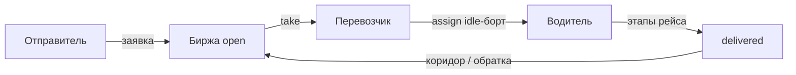
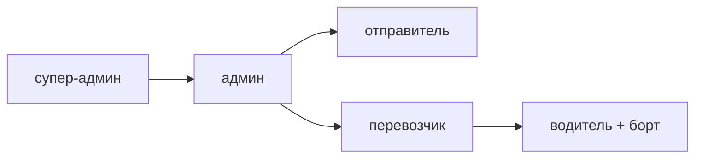

# Caspian LogHub

Цифровая биржа **внутрирегиональных** грузоперевозок Мангистауской области: заявки отправителей, борт перевозчика, попутные грузы вместо возврата без груза.

Кейс — только перевозки внутри области (магазины, фермы, стройки, отдалённые посёлки). Не порт и не международный транзит.

Доступ строится на трёх вещах сразу: **роль**, **владение** (своя заявка / свой борт / своя точка) и **статус**. Чужой объект API отдаёт **404**, а не список «вам запрещено».





## Документация

Десять страниц, читать **сверху вниз**. Переход к следующей — ссылка **под заголовком** страницы.

### Стенд и продукт

| # | Документ | Зачем |
|---|----------|--------|
| 1 | [Быстрый старт](docs/getting-started.md) | Compose, учётки, цепочка проверки |
| 2 | [Роли и доступ](docs/roles-and-access.md) | RBAC, ownership, 404 вместо 403 |
| 3 | [Жизненный цикл заявки](docs/order-lifecycle.md) | Статусы и кто что нажимает |
| 4 | [Интерфейс](docs/frontend.md) | Кабинеты, карта, SSE |

### Логика и контракт

| # | Документ | Зачем |
|---|----------|--------|
| 5 | [Попутки и цена](docs/matching-and-pricing.md) | Коридор маршрута, топливо, ставка |
| 6 | [Модель данных](docs/data-model.md) | Таблицы, связи, статусы борта |
| 7 | [HTTP API](docs/api.md) | Эндпоинты, тела, коды ошибок |

### Устройство стенда

| # | Документ | Зачем |
|---|----------|--------|
| 8 | [Архитектура](docs/architecture.md) | Стек, realtime, контур продакшена |
| 9 | [Разработка](docs/development.md) | Тесты, конфиг, соглашения |
| 10 | [Продакшен](docs/deployment.md) | Docker, nginx, публичная ссылка |

## Запуск

```bash
cp .env.example .env
docker compose up --build -d
```

Кабинет: [http://localhost/](http://localhost/) (`frontend` :80). OpenAPI: [http://127.0.0.1:8000/docs](http://127.0.0.1:8000/docs) — gateway, без SPA.

Сид: `superadmin@caspian.kz`, пароль — `SUPERADMIN_PASSWORD` из `.env`. Дальше — [быстрый старт](docs/getting-started.md).

pytest: Postgres `caspian_test` + Redis. Команды и переменные — [разработка](docs/development.md).

## Что умеет MVP

1. **Биржа.** Заявка между пунктами, лента только `open` для перевозчика.
2. **Карта и навигатор.** MapLibre + OSM. Polyline и движение — после старта водителя (OSRM, кэш в БД).
3. **Попутки.** Коридор маршрута: крюк и экономия пустого пробега.
4. **Цена.** Рекомендация по км, весу и типу груза.
5. **Пробег на дашборде супер-админа.** «С грузом» и «Пустые». У админа — урезанный обзор.
6. **Роли и ownership.** Админ не ведёт парк, заявки и пункты.

## Экономика

- Без биржи пустой пробег ~**40%**.
- Обратная загрузка в коридоре (детур ≤ 90 км).
- Дизель **32 л / 100 км**, **295 ₸/л**.

Цифры и формулы: [попутки и цена](docs/matching-and-pricing.md).

## Что за рамками хакатона

Платежи, ЭЦП / SMS, нативное приложение, скоринг перевозчиков, тахографы.

## Структура

```
backend/app/          FastAPI, модели, access/roles, сид, навигация рейса
backend/tests/        матрица ролей и ownership
frontend/src/         React: лендинг, кабинеты ролей, карта
docs/                 страницы 1–10, порядок в таблице выше
docker-compose.yml    postgres + redis + 2×backend + frontend :80 + gateway :8000
```
