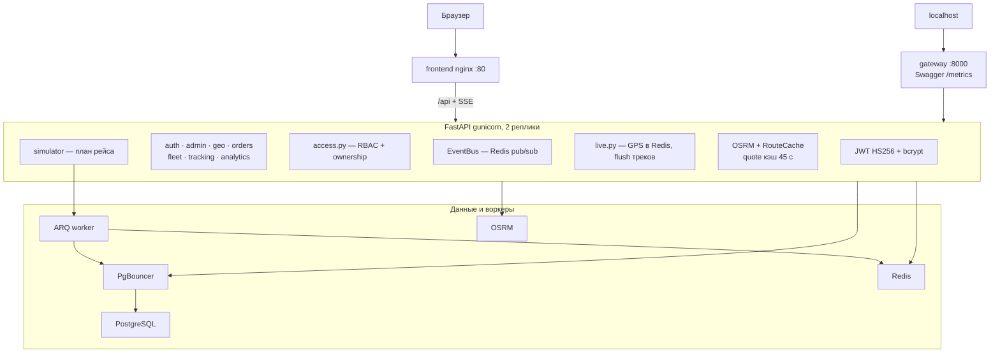
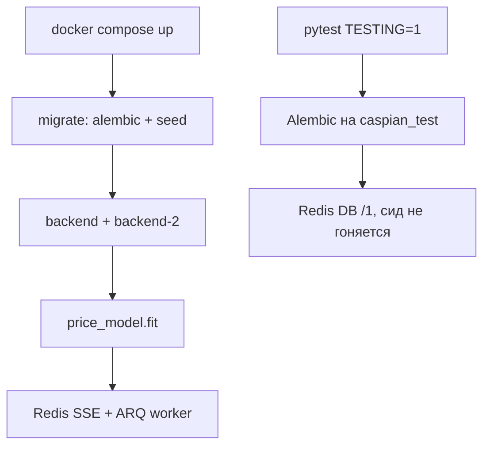
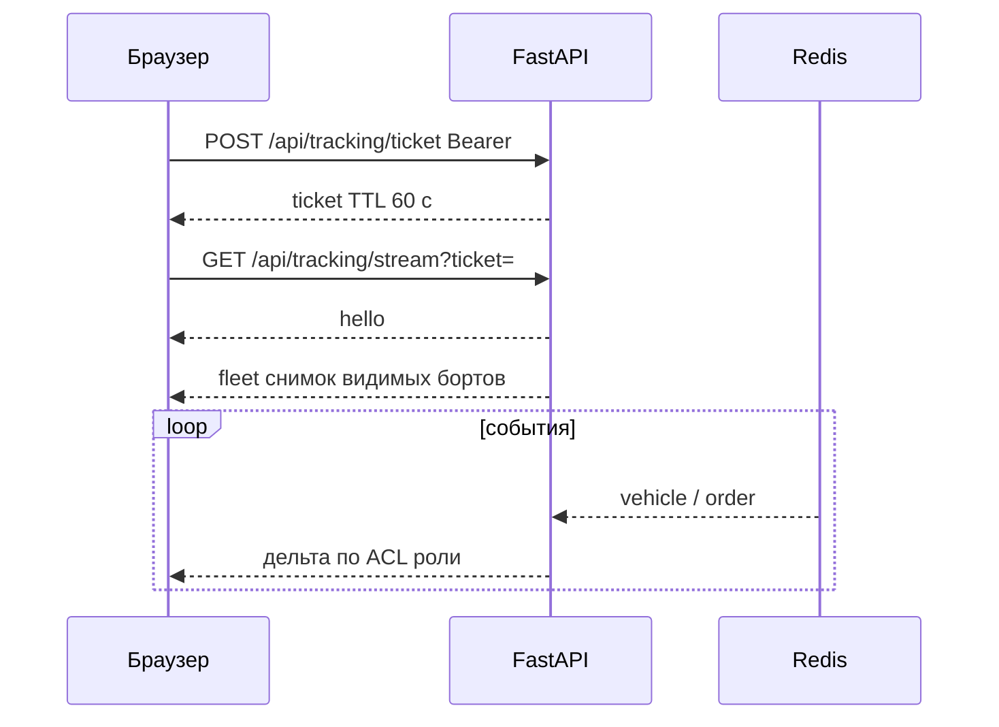
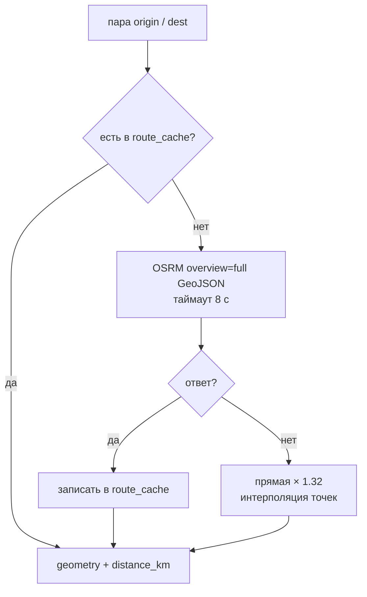
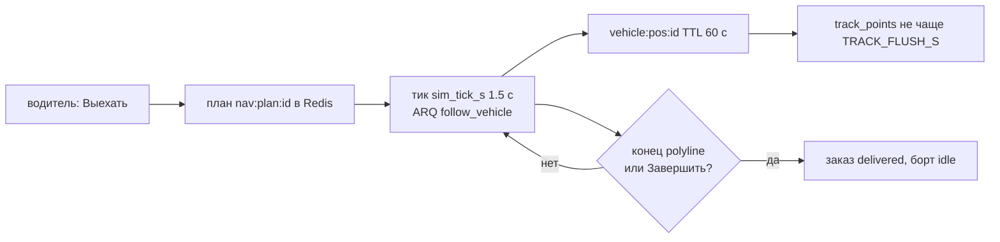
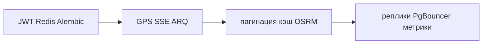

# Архитектура

8 / 10 · [← HTTP API](api.md) · [Оглавление](../README.md) · [Разработка →](development.md)

LogHub — монорепозиторий: FastAPI + React. Навигация рейса — ARQ-воркер. Без PostgreSQL и Redis процесс не стартует.

## Стек

| Слой | Технологии |
|------|------------|
| Backend | FastAPI 0.115, SQLAlchemy 2, Pydantic 2, gunicorn + uvicorn workers |
| БД | PostgreSQL 16, Alembic, PgBouncer |
| Кэш / шина | Redis 7 |
| Frontend | React 18, Vite 6 (сборка), TypeScript, MapLibre GL, react-router-dom 6 |
| Карта | тайлы OSM, маршруты OSRM (контейнер `osrm`) |
| Realtime | Server-Sent Events, Redis pub/sub (`EventBus`) |
| Продакшен | Docker Compose: postgres + pgbouncer + redis + 2×backend + worker + `frontend` :80 + `gateway` :8000 |

Симуляция: ARQ (`arq app.worker.WorkerSettings`).

## Компоненты



## Дерево репозитория

```
backend/app/
  main.py                 FastAPI, CORS, lifespan (кэш маршрутов; каталог сидит migrate)
  config.py               DATABASE_URL, SECRET_KEY, REDIS_URL, OSRM, скорость сима
  auth.py                 JWT, bcrypt (старый SHA-256 принимается и перехешируется)
  access.py               роли, видимость, 404 на чужие объекты
  roles.py                константы ролей, кого можно создать
  models.py               SQLAlchemy-модели
  schemas.py              Pydantic DTO
  seed.py                 пункты Мангистау, супер-админ, кэш ключевых пар
  routers/                auth, admin, geo, orders, fleet, tracking, analytics
  services/
    events.py             шина SSE (каналы staff/fleet/sender/orders)
    live.py               живая GPS-точка, TTL треков
    cache.py              Redis GET/SET JSON (quote, analytics)
    metrics.py            Prometheus + счётчик SSE
    tracks.py             месячные партиции track_points
    osrm.py               маршрут + fallback по прямой
    matching.py           bbox, затем попутки / обратная загрузка
    pricing.py            рекомендация цены
    simulator.py          старт рейса, payload борта
    fleet.py              борт ↔ водитель
    geo.py                haversine, проекция на линию
  worker.py               ARQ: follow, prune, downsample, prefetch OSRM, партиции
  paging.py               limit/offset для списков
backend/alembic/          миграции
backend/tests/            матрица доступа
frontend/src/
  pages/                  Landing, Sender, Carrier, Driver, Dispatcher
  components/             Layout, MapView, FleetBoard, OrderPanel, Toast
docker-compose.yml
deploy/nginx-gateway.conf
scripts/deploy-linux.sh
scripts/prepare-osrm.sh
scripts/backup-postgres.sh
```

## Процессы при старте



1. Compose: сервис `migrate` — `alembic upgrade head` и `python -m app.seed` (пункты Мангистау, супер-админ, кэш ключевых пар).
2. Затем `backend` / `backend-2`: `ensure_schema` (лёгкие `ALTER` для старых БД), `price_model.fit`, Redis SSE.
3. `worker` — ARQ: follow, prune, downsample, prefetch.
4. Pytest отдельно: `TESTING=1`, база `caspian_test`, Redis `/1`, сид не гоняется.

## Realtime



`GET /api/tracking/stream` — SSE. Сначала `POST /api/tracking/ticket` (Bearer), затем `?ticket=`. Заголовок `Authorization` тоже принимается.

Первое событие после `hello` — снимок `fleet` (видимые борты, координаты из Redis если есть). Дальше только `vehicle` и `order`. Фильтр по `owner_id` / `driver_id` / `sender_id` без запроса в БД на каждый тик.

Каналы Redis: `loghub:staff`, `loghub:fleet:{carrier_id}`, `loghub:sender:{sender_id}`, `loghub:orders`.

События:

| `type` | Когда | Содержимое |
|--------|--------|------------|
| `hello` | подключение | `{}` |
| `fleet` | снимок парка | `vehicles[]` |
| `vehicle` | ping / живая точка | координаты одного борта |
| `order` / `order_new` | смена заявки | `id`, `status` |

Очередь подписчика — 200 событий; при переполнении клиент отключается (нужно переподключиться).

## Маршруты



1. Ищем пару origin/dest в `route_cache`.
2. Иначе запрос к OSRM (`overview=full`, GeoJSON), таймаут 8 с.
3. Если OSRM недоступен — прямая с коэффициентом 1.32 и интерполяцией точек.

В Compose `OSRM_URL=http://osrm:5000`. Пока граф не собран (`scripts/prepare-osrm.sh`), контейнер `osrm` не слушает порт — срабатывает шаг 3.

Смена координат своей точки отправителя сбрасывает кэш маршрутов, где эта точка — origin или dest.

## Движение борта



Маршрут и анимация включаются только на этапе `transit` (кнопка водителя «Выехать»).

- План в Redis (`nav:plan:{id}`).
- Цикл ARQ `follow_vehicle` тикает каждые `sim_tick_s` (1.5 с).
- Живая точка: Redis `vehicle:pos:{id}`, TTL 60 с. В `track_points` — не чаще чем раз в `TRACK_FLUSH_S` (20 с).
- Ping чаще 3 с → 429; позиция в Redis всё равно обновляется. Симулятор не двигает борт, пока GPS live.
- По концу polyline заявка становится `delivered`, борт — `idle` (то же делает «Завершить рейс»).

GPS с телефона необязателен. Follow-loop в контейнере `worker`.

## Аутентификация

- JWT HS256, `sub` = id пользователя, `ver` = `users.token_version`, срок `JWT_EXPIRE_HOURS` (по умолчанию 7 суток). Сброс пароля админом, смена пароля водителя перевозчиком и блокировка инкрементируют `ver` — старые токены перестают приниматься. Своя смена пароля сессию не рвёт. Пароль: bcrypt. Старые SHA-256 хеши (`SECRET_KEY:password`) принимаются и при логине переписываются в bcrypt.

Фронт хранит токен и пользователя в `localStorage` (`caspian_token`, `caspian_user`).

Одноразовый пароль при создании/сбросе уходит в поле ответа `initial_password`, в БД не хранится.

## Контур продакшена

Так собран стенд: сессии переживают рестарт API, живые точки и SSE идут через Redis, списки пагинируются, маршруты — свой OSRM, два процесса API за nginx, Postgres через PgBouncer.



- **Сессии и шина.** JWT HS256. Redis pub/sub (`loghub:events`). Alembic накатывает схему. Симулятор: ARQ `follow_vehicle`.
- **Живые точки.** Redis `vehicle:pos:{id}`, TTL 60 с; `track_points` не чаще 20 с; ping чаще 3 с → 429. Follow-loop в контейнере `worker`. Индекс `(vehicle_id, ts)`, prune старше 14 дней.
- **Списки и кэш.** Заявки и парк: `{items, total, limit, offset}`, `limit` по умолчанию 100, максимум 200. Redis ~45 с на `quote` и analytics (`super` / `staff`); хинты backhaul до 20 с. Matching сначала bbox ±0.85°, затем крюк. ARQ: `prefetch_osrm`, `downsample_tracks` (1 точка/мин старше суток).
- **Реплики и пул.** Nginx: gzip, `limit_req` 20 r/s, 5 r/m на логин, SSE без буфера (таймаут 3600 с). `backend` + `backend-2`, `least_conn`. Sticky sessions не нужны (JWT + Redis). Gateway `127.0.0.1:8000` — Swagger и `/metrics`. Миграции один раз (`migrate` в Postgres). API и worker ходят в PgBouncer (transaction); DDL мимо пула. `prepare_threshold=None` у psycopg3. Медленные запросы Postgres: 500 мс. Бэкап раз в сутки в `./backups/`.
- **Треки и метрики.** `track_points` — RANGE по месяцу `ts`; воркер создаёт следующие месяцы и дропает старше retention. `GET /metrics` (Prometheus), `GET /api/analytics/ops` (staff). p95 — `histogram_quantile` по `loghub_http_request_seconds`.
- **Gunicorn:** 2 × `UvicornWorker` на реплику, `--timeout 120`. На 1–2 vCPU не поднимайте `WEB_CONCURRENCY` без нужды.

Команды, порты и Compose — [продакшен](deployment.md).

## Границы стенда

В продукте нет: платежи, ЭЦП / SMS, нативное приложение, скоринг перевозчиков, тахографы, S3 (загрузок документов нет).

Одновременные сессии закрыты репликами и пулом. Дальше упираемся в диск и в один хост Compose.

| Узкое место | Где | Следствие |
|-------------|-----|-----------|
| Треки старше окна retention | партиции + prune | рост диска, если cron молчит |
| Нет S3 | вложения | файлы оказались бы на диске контейнера |
| Один хост Compose | весь стек | нет failover площадки |

Не делать без причины: микросервисы, TimescaleDB поверх помесячных партиций, Grafana, если метрик с `/metrics` хватает.

Порты и туннель — [продакшен](deployment.md).
