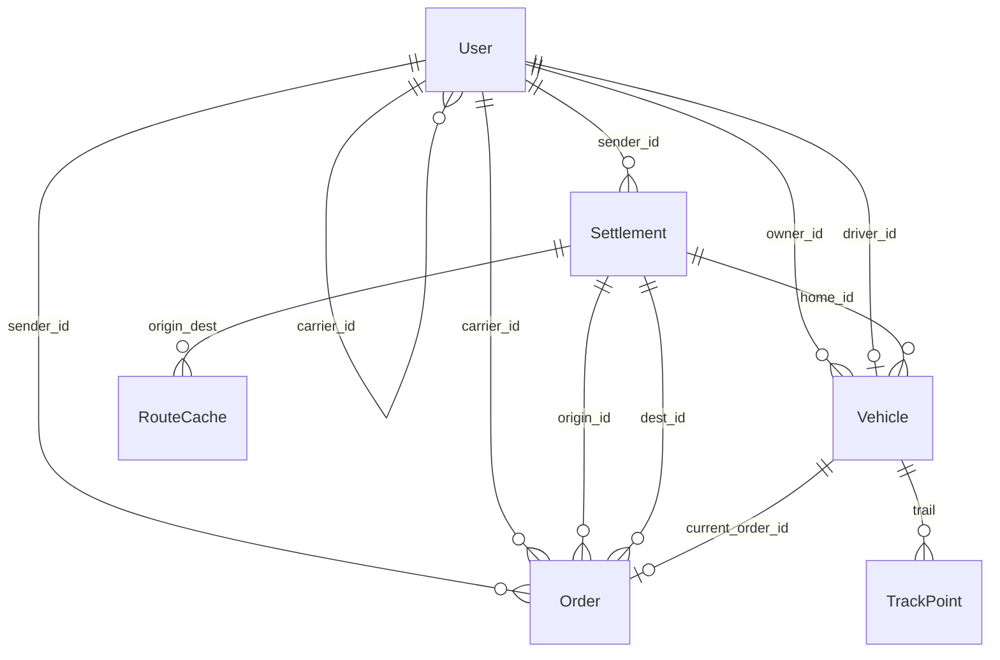
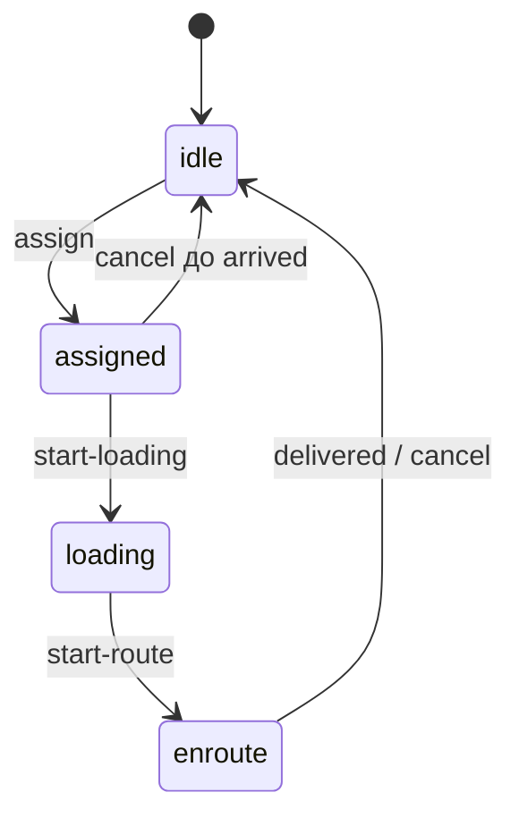

# Модель данных

6 / 10 · [← Попутки и цена](matching-and-pricing.md) · [Оглавление](../README.md) · [HTTP API →](api.md)

ORM — SQLAlchemy 2 (`backend/app/models.py`). Схема: Alembic (`backend/alembic/`). Pytest накатывает ту же схему на базу `caspian_test`. `ensure_schema` подтягивает старые Postgres.

## Диаграмма связей

`Settlement.sender_id` пустой — каталог области; задан — личная точка отправителя. Перевозчик владеет бортом (`owner_id`), водитель закреплён за одним бортом (`driver_id`) и принадлежит перевозчику (`users.carrier_id`).

## `users`

| Поле | Тип | Смысл |
|------|-----|--------|
| `id` | int PK | |
| `email` | string(160), unique | логин |
| `name` | string(160) | |
| `password_hash` | string(128) | bcrypt (старый SHA-256 переписывается на логине) |
| `role` | string(32) | `superadmin`, `admin`, `sender`, `carrier`, `driver` (legacy `dispatcher` = админ) |
| `company` | string(160) | |
| `phone` | string(32) | |
| `carrier_id` | FK users, nullable | у водителя — свой перевозчик |
| `is_active` | bool | блокировка входа |
| `token_version` | int, default 0 | клейм `ver` в JWT; инкремент при сбросе пароля и блокировке |

## `settlements`

Справочник точек. `sender_id IS NULL` — платформенный каталог (Актау, Шетпе, промзоны…). `sender_id` задан — личная точка отправителя.

| Поле | Смысл |
|------|--------|
| `name` | уникальное название |
| `kind` | `city`, `village`, `industrial`, `construction` |
| `lat`, `lon` | WGS84 |
| `population` | для городов/сёл; у промзон 0 |
| `note` | подпись |

В сиде ~25 пунктов Мангистау и ключевые пары маршрутов в `route_cache`.

## `vehicles` (в UI — «борт»)

Борт = машина + водитель. Отдельной сущности «водитель без борта» в кабинете перевозчика нет: создание борта сразу заводит учётку `driver`.

| Поле | Смысл |
|------|--------|
| `plate` | госномер, unique |
| `kind` | `tent`, `reefer`, `dump`, `flatbed` |
| `capacity_kg` | до 60 000 при создании |
| `owner_id` | перевозчик |
| `driver_id` | учётка водителя |
| `driver_name` | денормализованное имя |
| `status` | `idle`, `assigned`, `enroute`, `loading` |
| `lat`, `lon`, `heading` | текущая точка |
| `live_until` | живой GPS до этого момента |
| `home_id` | база (только каталог области, не личная точка отправителя) |
| `current_order_id` | активный рейс |
| `active` | отключённый борт нельзя назначить |

Отключить борт или заблокировать водителя нельзя, пока `current_order_id` задан.

## `orders`

Вес: `1 … 39 999` кг.

| Поле | Смысл |
|------|--------|
| `cargo_type` | `general`, `perishable`, `construction`, `fuel`, `livestock` |
| `cargo_title` | свободный заголовок |
| `price_offered` / `price_recommended` | тенге |
| `status` | см. [жизненный цикл](order-lifecycle.md) |
| `distance_km` | по OSRM или fallback |
| `empty_km_saved` | оценка экономии пустого пробега при назначении |
| `is_backhaul` | true, если матчер нашёл попутку |
| `taken_at`, `delivered_at` | метки |

## `track_points`

След борта. `source`: `nav` (симулятор), `live` (ping водителя), `sim` (по умолчанию в модели). Таблица секционирована по месяцу `ts` (`PARTITION BY RANGE`). Индекс `(vehicle_id, ts)`.

## `route_cache`

Уникальность `(origin_id, dest_id)`. `geometry` — JSON-массив координат GeoJSON `[lon, lat]`.

## `historical_trips`

Обучающая выборка для цены (км, вес, тип груза, цена, был ли возврат без груза). В текущем сиде таблица может оставаться пустой — тогда используются запасные коэффициенты. Доля пустого пробега в аналитике (`empty_share_history`) считается по этой таблице.

## Статусы борта vs заявки

| Заявка | Типичный `vehicles.status` |
|--------|----------------------------|
| `assigned` / `arrived` | `assigned` |
| `loading` | `loading` |
| `transit` | `enroute` |
| нет рейса / `delivered` / `cancelled` | `idle` |

Статусы заявки подробно — в [жизненном цикле](order-lifecycle.md).
