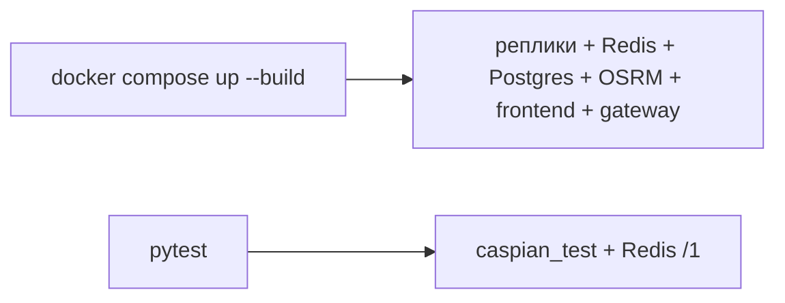

# Разработка

9 / 10 · [← Архитектура](architecture.md) · [Оглавление](../README.md) · [Продакшен →](deployment.md)



## Окружение бэкенда

Задаётся Compose из корневого `.env` (`backend/app/config.py`). Без `DATABASE_URL` (PostgreSQL) и `REDIS_URL` API не стартует.

| Переменная | Смысл |
|------------|--------|
| `DATABASE_URL` | `postgresql+psycopg://caspian:…@pgbouncer:5432/caspian` |
| `POSTGRES_HOST_PORT` | порт Postgres на хосте (по умолчанию 5432; для pytest с Windows) |
| `SECRET_KEY` | JWT, обязателен |
| `SUPERADMIN_PASSWORD` | пароль сида супер-админа |
| `JWT_EXPIRE_HOURS` | срок токена, по умолчанию 7 суток |
| `REDIS_URL` | `redis://redis:6379/0`; обязателен для SSE и GPS |
| `PING_MIN_INTERVAL_S` | лимит GPS ping (3) |
| `TRACK_FLUSH_S` | как часто писать точку в Postgres (20) |
| `TRACK_RETENTION_DAYS` | cron воркера чистит старые треки (14) |
| `DB_POOL_SIZE` / `DB_MAX_OVERFLOW` | пул SQLAlchemy; в Compose 5 / 10 за PgBouncer |
| `CACHE_TTL_S` | Redis-кэш quote и analytics (45) |
| `WEB_CONCURRENCY` | воркеры gunicorn (2) |
| `CORS_ORIGINS` | список через запятую |
| `OSRM_URL` | `http://osrm:5000` |
| `SIM_SPEED_KMH` / `SIM_TICK_S` | ускорение демо |

Не коммитить `.env` (см. `.gitignore`).

Схема и каталог пунктов: сервис `migrate` (`alembic upgrade head` и `python -m app.seed`).

## Зависимости

Backend: FastAPI, uvicorn/gunicorn, SQLAlchemy, Alembic, ARQ, psycopg, PyJWT, bcrypt, redis, pydantic-settings, httpx, numpy, prometheus_client, pytest.

Frontend: react, react-dom, react-router-dom, maplibre-gl. Сборка: `npm run build`.

## Тесты

```bash
cd backend
python -m pytest
```

Нужны Postgres и Redis на localhost. Compose публикует Redis на `127.0.0.1:6379` и Postgres на `127.0.0.1:${POSTGRES_HOST_PORT:-5432}` (внутри сети контейнер всё равно слушает 5432). Если на хосте уже стоит PostgreSQL (часто Windows-службы на 5432/5433), задайте в `.env` свободный порт, например `POSTGRES_HOST_PORT=15432`. pytest читает ту же переменную. `TESTING=1` отключает сид и живой OSRM; схема — Alembic; SSE/GPS идут в Redis (`TEST_REDIS_URL`, по умолчанию DB `/1`). База только `caspian_test`.

`tests/test_access.py` проверяет:

- закрытые списки без токена (401);
- супер-админ не создаёт отправителя, админ не создаёт админа;
- чужая заявка — 404, в том числе cancel;
- take только `open`, второй take 409, чужой перевозчик 404;
- чужой борт 404; отправитель не видит чужой парк до назначения;
- этапы только водитель: arrive → loading → start-route → complete;
- skip `assigned` → `transit` = 409;
- delete только `open`; cancel `assigned` освобождает борт;
- правка email/пароля водителя и блокировка входа;
- заявки создаёт только отправитель.

`tests/test_auth.py` — JWT при логине и перехеш старого SHA-256 в bcrypt.
`tests/test_live.py` — фильтр SSE по роли, ping/flush через Redis.
`tests/test_stage3.py` — пагинация, bbox-матчинг, SQL-аналитика, downsample треков.
`tests/test_stage4.py` — `/metrics`, `/api/analytics/ops`, партиции Postgres.

## Соглашения, которые легко сломать

- **404 на чужие id** — не заменять на 403 в `get_order_or_404` / `get_owned_*`.
- **Не пропускать статусы** — `_advance` сравнивает expected.
- **Борт в UI = `vehicles` в БД.**
- **Симулятор:** follow-loop в ARQ worker.
- **Создание борта = создание водителя.** Один водитель — один борт (`attach_driver`).
- Роль `dispatcher` нормализуется в `admin`.
- Пароль в ответе только как `initial_password` при создании/сбросе, не из БД.

Ограничения MVP — [границы стенда](architecture.md#границы-стенда). Контур продакшена — [архитектура](architecture.md#контур-продакшена).

## Полезные URL

| | |
|--|--|
| UI | http://localhost/ |
| OpenAPI | http://127.0.0.1:8000/docs |
| Health | http://127.0.0.1:8000/api/health |
