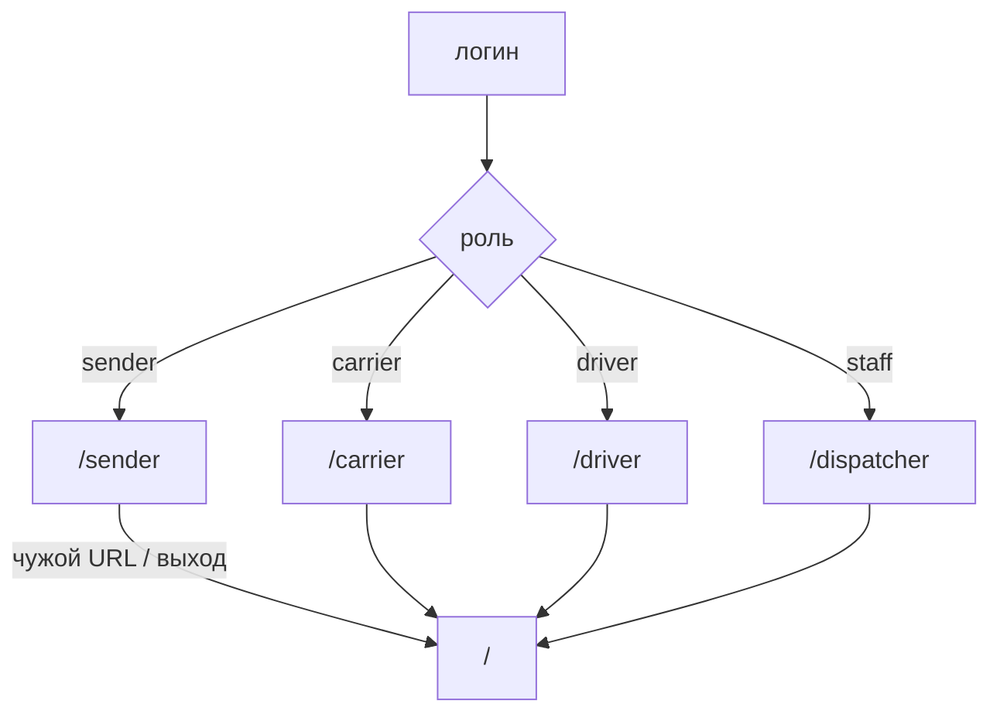
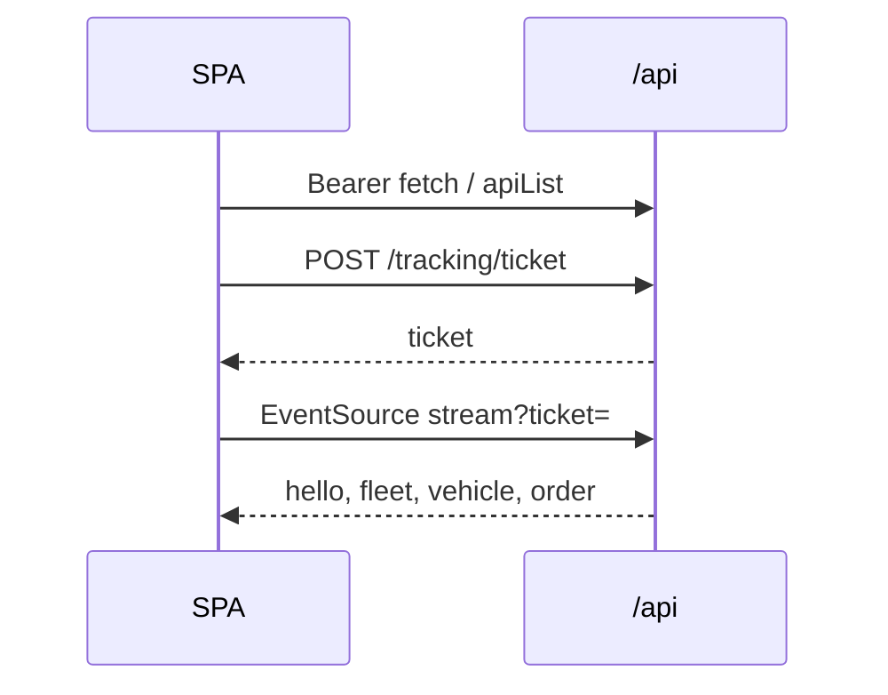

# Интерфейс

4 / 10 · [← Жизненный цикл заявки](order-lifecycle.md) · [Оглавление](../README.md) · [Попутки и цена →](matching-and-pricing.md)

SPA на React 18. Сборка Vite, карта MapLibre + OSM. Стили — `frontend/src/styles.css`, тема светлая/тёмная (`theme.tsx`).

## Маршруты

| Путь | Кто | Если чужой |
|------|-----|------------|
| `/` | гости — лендинг; залогиненный редирект в свой кабинет | |
| `/sender` | отправитель | на `/` |
| `/carrier` | перевозчик | на `/` |
| `/driver` | водитель | на `/` |
| `/dispatcher` | супер-админ и админ | на `/` |

Логотип ведёт в свой кабинет. Выход — на главную, сессия чистится в `localStorage`.

Кабинет по роли: `cabinetOf` в `App.tsx`. Staff (включая legacy `dispatcher`) идёт на `/dispatcher`.

## Общие механики

- `api.ts` — `fetch` с Bearer, разбор ошибок; списки заявок/парка — `apiList` (конверт `{items, total}`).
- `openEventStream` — `POST /api/tracking/ticket`, затем SSE с `?ticket=`.
- Тосты: пароль новой учётки показывается один раз.
- Карта (`MapView`): пункты, борт, polyline рейса, след. У отправителя на вкладке «Пункты» клик ставит координаты новой точки.

nginx проксирует `/api/` на две реплики API, gzip и лимит запросов; SSE без буфера.

## Лендинг

О проекте, вход email + пароль. Кабинетов и живой карты нет. Демо-учётка подсказывается с `/api/auth/demo`.

## Отправитель

Вкладки: **новая заявка**, **мои заявки**, **пункты**.

- Котировка при выборе origin/dest/веса/типа.
- Правка и отмена, пока заявка открыта; удаление только `open`.
- На карте борт своего рейса и маршрут после старта водителя.
- Свои точки: клик по карте + форма. Каталог области только для выбора в заявке.

## Перевозчик

Вкладки: **дашборд**, **биржа**, **рейсы**, **парк**.

- Биржа — только `open`; хинты попуток с `/hints/backhaul`.
- Взять на компанию → назначить свободный борт на «Рейсах».
- Парк (`FleetBoard`): создать/править борт, отключить, сменить пароль водителя.
- Карта: свой парк и рейсы в `transit`.

## Водитель

Только свой борт и назначенный рейс. Кнопки по статусу: прибыл → погрузка → выехать → завершить. Опционально трансляция геолокации браузера (`ping`). Без парка и биржи.

## Супер-админ / админ (`Dispatcher.tsx`)

| | Супер-админ | Админ |
|--|-------------|--------|
| Вкладки | Дашборд, Админы | Обзор, Пользователи |
| Карта и live-парк | да | обзор без живых деталей флота |
| Аналитика | полная (пустой пробег, топливо, коридоры) | урезанная |
| Пользователи | только админы | отправители и перевозчики |
| Рейсы | не запускает | не запускает |

Счётчики на дашборде кликабельны (списки отправителей, бортов, открытых заявок и т.д.). SSE обновляет парк; аналитика опрашивается раз в 10 с.

## Компоненты

| Файл | Роль |
|------|------|
| `Layout.tsx` | шапка, логин, выход |
| `MapView.tsx` | MapLibre |
| `FleetBoard.tsx` | CRUD борта |
| `OrderPanel.tsx` | карточка заявки отправителя |
| `Toast.tsx` / `Empty.tsx` | уведомления и пустые состояния |

Типы зеркалят DTO бэкенда: `frontend/src/types.ts`. Подписи статусов — `lib/labels.ts`.
