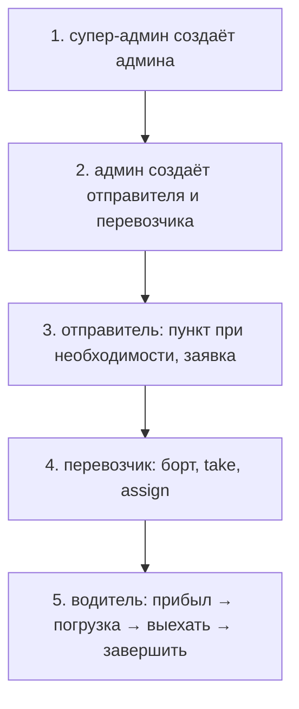

# Быстрый старт

1 / 10 · [Оглавление](../README.md) · [Роли и доступ →](roles-and-access.md)

Стек — Docker Compose: PostgreSQL, Redis, две реплики API, gateway, контейнер `frontend` (nginx со статикой Vite). API стартует только с PostgreSQL и Redis.

## Поднять стенд

Из **корня** репозитория (не из `backend/`):

```bash
cp .env.example .env
# SECRET_KEY, POSTGRES_PASSWORD, SUPERADMIN_PASSWORD
docker compose up --build -d
```

Или `bash scripts/deploy-linux.sh`.

| Что | URL | Сервис |
|-----|-----|--------|
| Кабинет | [http://localhost/](http://localhost/) | контейнер `frontend`, порт 80 |
| OpenAPI / метрики | [http://127.0.0.1:8000/docs](http://127.0.0.1:8000/docs) | `gateway`; SPA здесь нет |

На Windows порт 80 часто занят IIS — тогда API на `:8000` живой, а кабинет не открывается. Порты, nginx и туннель — [продакшен](deployment.md).

Граф OSRM отдельно: `bash scripts/prepare-osrm.sh`. Пока файла нет, маршруты строятся по прямой.

## Вход

В сиде одна учётка: `superadmin@caspian.kz`. Пароль — `SUPERADMIN_PASSWORD` из `.env`.

Остальных заводите в интерфейсе. Пароль при создании можно оставить пустым — сервер сгенерирует и покажет **один раз** в тосте. Заблокированная учётка не входит.

## Цепочка проверки с нуля



1. Войти как супер-админ — создать админа.
2. Войти как админ — создать отправителя и перевозчика.
3. Отправитель — при необходимости добавить пункт, разместить заявку.
4. Перевозчик — создать борт (водитель + машина), взять заявку с биржи, назначить борт.
5. Водитель — «Я прибыл» → «Начать погрузку» → «Выехать» → «Завершить рейс».

pytest и переменные окружения — в [разработке](development.md) (страница 9).
