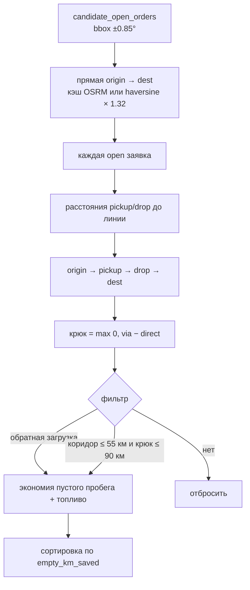
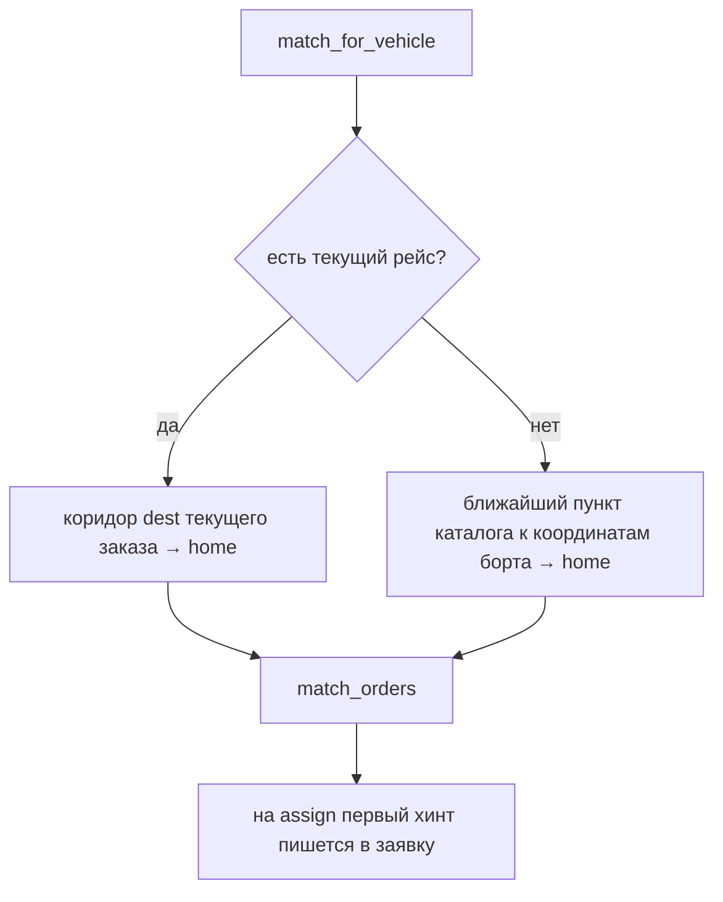

# Попутки и цена

5 / 10 · [← Интерфейс](frontend.md) · [Оглавление](../README.md) · [Модель данных →](data-model.md)

Модули: `backend/app/services/matching.py`, `pricing.py`. Константы экономики зашиты в код (питч хакатона).

## Зачем

Без биржи пустой пробег оценивается как **~40%**. Платформа ищет обратную загрузку и попутный груз в коридоре маршрута, чтобы машина не ехала пустой к базе.

Выигрывают перевозчик (топливо), отправитель (срок и цена), акимат (видимость потоков на дашборде супер-админа).

## Константы

| Параметр | Значение |
|----------|----------|
| Ширина коридора | 55 км от polyline |
| Максимальный крюк | 90 км |
| «Рядом со стартом» | 40 км |
| «Рядом с финишем» | 45 км |
| Расход дизеля | 32 л / 100 км |
| Цена дизеля | 295 ₸/л |
| Пустой пробег без платформы | 40% загруженных км |

## Как выбирается попутка

`match_orders(origin, dest, open_orders)` — точный крюк. Кандидаты заранее сужает `candidate_open_orders`: SQL-bbox ±0.85° вокруг origin/dest (точка заявки в коридоре, если origin или dest попадает в прямоугольник).

1. Прямая `origin → dest` — из кэша OSRM или haversine × 1.32.
2. Для каждой открытой заявки:
   - расстояние pickup/drop до линии маршрута;
   - путь `origin → pickup → drop → dest`;
   - крюк = max(0, via − direct).
3. Заявка проходит, если:
   - **обратная загрузка**: pickup близко к origin **или** (pickup < 70 км от origin и drop близко к dest), или
   - **коридор**: pickup и drop ≤ 55 км от линии **и** крюк ≤ 90 км.
4. Экономия пустого пробега: сравнение «ехать пустым по этому плечу» vs крюк; дополнительно `min(loaded, direct) − 0.35 × detour`.
5. Топливо и тенге из констант выше.
6. Сортировка по убыванию `empty_km_saved`.

Тексты `reason`:

- обратная загрузка к базе;
- попутный груз в коридоре;
- подбор рядом со стартом.

### Для конкретного борта

`match_for_vehicle`:

- есть текущий рейс → коридор **куда везём сейчас → база** (`dest` текущего заказа → `home`);
- idle → ближайший к координатам борта пункт каталога → база.

На `assign` первый хинт пишется в заявку (`empty_km_saved`, `is_backhaul`).

Эндпоинты: `GET /api/orders/hints/backhaul`, `GET /api/orders/hints/leg`.

## Рекомендация цены

`PriceModel`:

- если в `historical_trips` ≥ 8 строк — МНК (lstsq): константа, км, вес/100, one-hot типа груза;
- иначе эвристика: `9000 + 48×км + 0.11×кг`, множители типа груза.

| `cargo_type` | Множитель (fallback) |
|--------------|----------------------|
| `general` | 1.00 |
| `construction` | 1.08 |
| `livestock` | 1.18 |
| `perishable` | 1.22 |
| `fuel` | 1.35 |

Результат округляется до сотен тенге, нижняя граница при обученной модели — 8000 ₸.

Котировка `GET /api/orders/quote` и создание заявки используют одну модель. Отправитель может поставить свою `price_offered`.

## Аналитика дашборда

- Загруженные км — сумма `distance_km` по `delivered`.
- Сэкономленный пустой пробег — сумма `empty_km_saved` по доставленным и активным.
- База без платформы — 40% загруженных км.
- С платформой — max(0, база − экономия).
- Коридоры — топ-8 пар origin/dest по км (`GROUP BY` в SQL, доставленные + `transit`). Сводка кэшируется в Redis ~45 с (разные ключи для супер-админа и админа).

Полные поля пустого пробега и `empty_share_history` — только супер-админ.

Эндпоинты котировки и хинтов — в [HTTP API](api.md).
