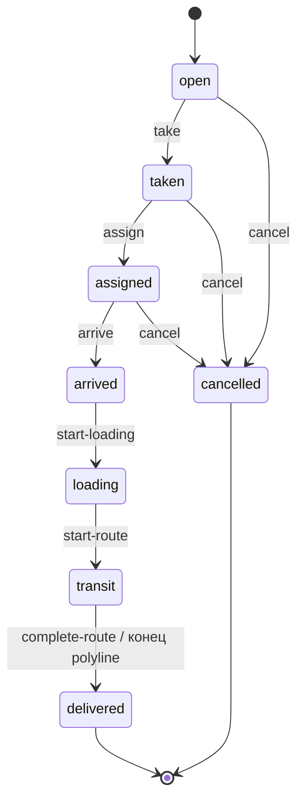
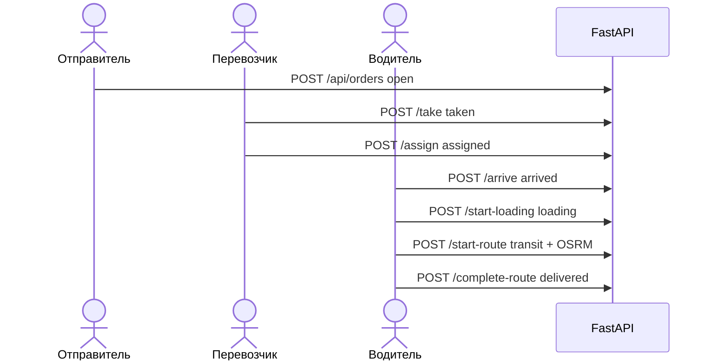
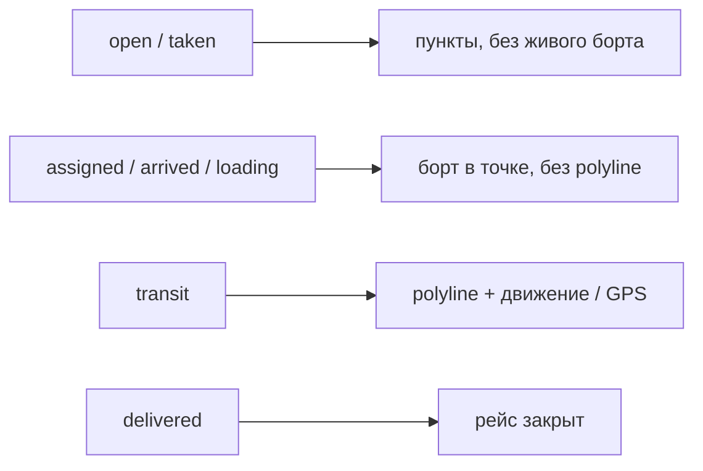

# Жизненный цикл заявки

3 / 10 · [← Роли и доступ](roles-and-access.md) · [Оглавление](../README.md) · [Интерфейс →](frontend.md)

## Граф статусов

В API статус в пути — `transit` (не `IN_TRANSIT`). Legacy-алиас `pickup` в коде приравнивается к погрузке.

Пропускать этапы нельзя: `assigned` → `transit` даёт 409.

## Кто двигает статус

| Шаг | Кто | Эндпоинт / действие |
|-----|-----|---------------------|
| Разместить | отправитель | `POST /api/orders` |
| Править / удалить `open` | отправитель | `PATCH` / `DELETE /api/orders/{id}` |
| Отменить `open`, `taken`, `assigned` | отправитель | `POST /api/orders/{id}/cancel` |
| Взять с биржи | перевозчик | `POST /api/orders/{id}/take` |
| Назначить idle-борт | перевозчик | `POST /api/orders/{id}/assign` |
| «Я прибыл» | водитель | `POST /api/tracking/arrive` |
| «Начать погрузку» | водитель | `POST /api/tracking/start-loading` |
| «Выехать» | водитель | `POST /api/tracking/start-route` — строится маршрут, стартует движение |
| «Завершить рейс» | водитель | `POST /api/tracking/complete-route` |
| Остановить анимацию (борт остаётся в рейсе) | водитель | `POST /api/tracking/stop-route` |

## Что происходит на шаге

### `open`

На бирже. Цена: если `price_offered` не задан — берётся рекомендация. Дистанция из OSRM/кэша.

### `taken`

`carrier_id` = текущий перевозчик, `taken_at` сейчас. Чужие перевозчики заявку больше не видят. Борт ещё не занят.

### `assigned`

Свободный активный борт компании с водителем. Проверка веса. Если матчер находит попутку относительно базы борта — пишутся `empty_km_saved` и `is_backhaul`. `vehicle.current_order_id` = заявка, статус борта `assigned`. Повторный assign до прибытия можно сменить борт (старый освобождается).

### `arrived`

Водитель на месте погрузки. Отмена отправителем уже запрещена. Борт остаётся `assigned`.

### `loading`

Погрузка. Статус борта `loading`.

### `transit`

OSRM polyline в Redis, борт в начало маршрута, статус борта `enroute`. Тик симулятора пишет след. Опционально GPS: `POST /api/tracking/ping`.

`stop-route` снимает план движения, заявка остаётся `transit`, борт `enroute` без анимации.

### `delivered`

Борт `idle`, `current_order_id` пустой, `delivered_at` задан. Тот же исход, если симулятор доехал до конца polyline.

### `cancelled`

Только до `arrived`. `release_bort`: план сима сброшен, борт свободен.

## Карта по этапам

| Статус | Что на карте |
|--------|----------------|
| `open` / `taken` | пункты, без живого борта у отправителя |
| `assigned` / `arrived` / `loading` | борт в точке (ещё без polyline движения) |
| `transit` | polyline + движение / GPS |
| `delivered` | рейс закрыт |

Цепочка с нуля — в [быстром старте](getting-started.md).
